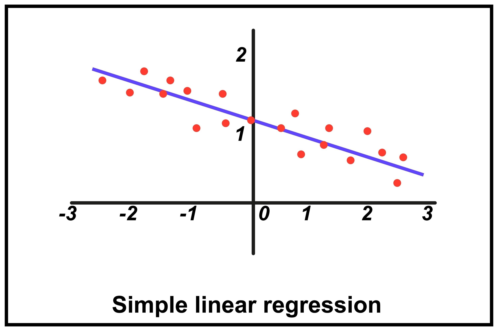

# 📺 Regression Intro - Practical Machine Learning Tutorial with Python p.2 oleh Sentdex  [Sentdex](https://youtu.be/JcI5Vnw0b2c?si=Lvt5Fq59rf8Cr5Ln)

### 1. Memahami Regresi Linear

- **Waktu:** [[00:39]](https://youtu.be/JcI5Vnw0b2c?list=PLQVvvaa0QuDfKTOs3Keq_kaG2P55YRn5v&t=39)

- **Poin Penting:** Regresi adalah metode untuk memodelkan data kontinu dengan mencari garis _best-fit_ yang mengikuti persamaan _y = mx + b_.

- **Strategi:** Gunakan regresi untuk memprediksi nilai (seperti harga saham) di mana data input bersifat berkesinambungan (_continuous data_).

---

### 2. Konsep Fitur dan Label

- **Waktu:** [[01:34]](https://youtu.be/JcI5Vnw0b2c?list=PLQVvvaa0QuDfKTOs3Keq_kaG2P55YRn5v&t=94)

- **Poin Penting:** Segala sesuatu dalam _supervised machine learning_ bermuara pada **Fitur** (atribut/input data) dan **Label** (hasil atau target prediksi).

- **Strategi:** Identifikasi fitur sebagai _attributes_ yang membentuk label, dan tentukan label sebagai prediksi masa depan yang ingin dicapai.

---

### 3. Pembersihan Data & Fitur yang Bermakna

- **Waktu:** [[03:34]](https://youtu.be/JcI5Vnw0b2c?list=PLQVvvaa0QuDfKTOs3Keq_kaG2P55YRn5v&t=214)

- **Poin Penting:** Tidak semua kolom mentah (Open, High, Low, Close) memberikan informasi unik. Menggunakan terlalu banyak fitur yang berlebihan (_redundant_) bisa menyebabkan _noise_ pada model sederhana.

- **Strategi:** Sederhanakan data dengan hanya memilih kolom yang benar-benar relevan (seperti harga yang sudah disesuaikan atau _adjusted prices_ yang sudah mengakomodasi _stock splits_).

---

### 4. Feature Engineering (Pembuatan Fitur Baru)

- **Waktu:** [[06:32]](https://youtu.be/JcI5Vnw0b2c?list=PLQVvvaa0QuDfKTOs3Keq_kaG2P55YRn5v&t=392)

- **Poin Penting:** Model linear tidak bisa secara otomatis mengenali hubungan antar kolom mentah. Kita harus mendefinisikan hubungan tersebut secara eksplisit sebagai fitur baru agar model lebih pintar.

- **Strategi:**

- **Volatilitas (`HL_PCT`):** `(High - Close) / Close * 100`. Digunakan untuk mengukur volatilitas harian.

- **Momentum (`PCT_change`):** `(Close - Open) / Open * 100`. Digunakan untuk mengukur pergerakan harga harian.

- **Normalisasi:** Mengalikan dengan 100 bukan untuk algoritma, tetapi agar angka lebih mudah dibaca dan diinterpretasikan oleh manusia.

---

### 5. Persiapan Menuju Prediksi

- **Waktu:** [[10:11]](https://youtu.be/JcI5Vnw0b2c?list=PLQVvvaa0QuDfKTOs3Keq_kaG2P55YRn5v&t=611)

- **Poin Penting:** Menentukan posisi `adj_close` dalam model.

- **Strategi:** Lakukan refleksi sebelum _coding_ berikutnya: Apakah harga penutupan (`adj_close`) saat ini akan dijadikan fitur, atau justru menjadi label (target) untuk prediksi di masa depan?

---

## Hal Penting Lain dari Video:

- **Pendekatan "Data Science Thinking":** Fokuslah pada hubungan antar atribut. Sentdex menekankan bahwa seringkali hubungan antara dua variabel jauh lebih berharga daripada variabel itu sendiri.

- **Pentingnya Validitas:** Pilihlah fitur yang memang logis memiliki pengaruh terhadap target yang ingin diprediksi. Jangan hanya memasukkan data mentah tanpa memahami apa yang diwakilinya di dunia nyata.

- **Konsistensi:** Selalu gunakan _adjusted prices_ dalam analisis saham untuk menghindari distorsi data akibat perubahan struktur perusahaan (seperti _stock splits_), agar model tidak salah mengartikan perubahan harga sebagai fluktuasi pasar yang sebenarnya.

_Video Referensi_: [Regression Intro - Practical Machine Learning Tutorial with Python p.2](https://youtu.be/JcI5Vnw0b2c?si=Lvt5Fq59rf8Cr5Ln)
